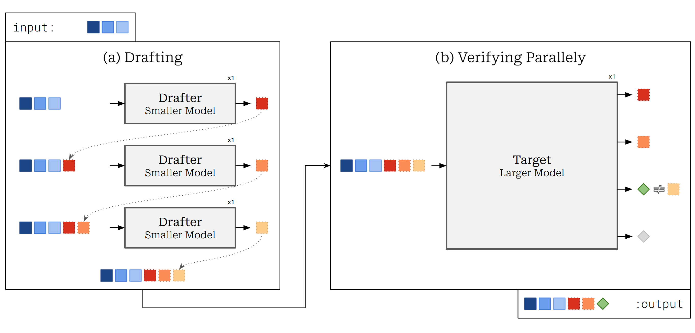

## 📋 Project Overview

This research project develops a novel approach to secure code generation by **injecting security signals directly into the LLM decoding process** at inference time, without requiring model retraining. Unlike traditional approaches that rely on pre-generation prompting or post-generation pattern matching, our system computes quantitative security scores and uses them to influence token selection probabilities during generation.

**Key Innovation**: Security enforcement happens *during* the decoding loop itself — modifying the token probability distribution in real-time based on external security knowledge.

## What is Speculative Decoding?

Speculative Decoding is a decoding strategy for transformers that allows to generate sequences faster than the classic auto-regressive decoding without changing the output distribution or requiring further fine-tuning. It uses a smaller, more efficient approximation model (called a "drafter") to generate speculative token prefixes. These prefixes are then evaluated in parallel by the larger target model, reducing the number of serial decoding steps required and leading to inference speedups.

The core process rely on the specific behavior of the Transformer model that allows to compute the probability distribution of all the fed in tokens. This distribution is then used to verify the drafts generated by the drafter model.

<p align="center">
    
    <br>
    <em>Figure 2: Overview of Speculative Decoding.</em>
</p>

## 📊 Current Status (Sprint 1, Week 3)

### ✅ Completed
- **Sprint 1 Validation Work**: Successfully implemented and tested speculative decoding mechanics
- **Experimental Findings**:
  - Model pairing significantly affects speedup: Llama 3.2 3B+1B achieved 1.53x speedup, 92.9% acceptance rate
  - Base models vs. instruction-tuned models behave fundamentally differently:
    - N-gram decoding: 84-100% acceptance with base models, 9.1% with instruction-tuned
    - Model-pair decoding: 92.9% acceptance with instruction-tuned models
  - Identified integration points in speculative decoding codebase for security score injection
- **Hardware**: Validated on RTX 3050 6GB GPU in WSL environment

## 📁 Repository Structure

```
.
├── README.md                          # This file
├── requirements.txt                   # Python dependencies
├── docs/
│   ├── architecture.md                # Detailed architecture documentation
│   ├── previous_work.md               # Context from deprecated approach
│   └── research_notes.md              # Ongoing research findings
├── src/
│   ├── scoring/                       # Security score computation (Layer 2)
│   │   ├── codeql_scorer.py          # CodeQL-based scoring
│   │   ├── neural_scorer.py          # Neural model-based scoring
│   │   └── score_translation.py      # Vulnerability → score mapping
│   ├── decoding/                      # Decoding integration (Layer 3)
│   │   ├── logit_processors.py       # Logit biasing implementations
│   │   ├── speculative_secure.py     # Security-augmented speculative decoding
│   │   └── rejection_sampling.py     # Rejection sampling with security
│   ├── retrieval/                     # CWE knowledge retrieval (Layer 1)
│   │   ├── tag_detection.py          # Task classification
│   │   └── cwe_retrieval.py          # Security knowledge lookup
│   └── evaluation/                    # Benchmarking (Layer 4)
│       ├── metrics.py                # Security & correctness metrics
│       └── baselines.py              # Baseline implementations
├── experiments/
│   ├── sprint1_speculative_decoding/ # Sprint 1 validation work
│   └── security_scoring_tests/       # Score computation experiments
├── data/
│   ├── cwe_corpus/                   # Security knowledge base
│   └── benchmarks/                   # Test datasets
└── tests/
    └── ...                           # Unit and integration tests
```


## How to use

### Setup

```bash
# Clone the repository
git clone https://github.com/yourusername/secure-code-generation.git
cd secure-code-generation

# Create virtual environment
python -m venv venv
source venv/bin/activate  # On Windows: venv\Scripts\activate

# Install dependencies
pip install -r requirements.txt

### 2. Run console interface Inference

You can run `infer.py` in your console to generate text using the console interface. You can easily change the hyperparameters of the generation, compare target and speculative generation, enable drafter generation and much more.

```bash
python infer.py
```

To change the models used, you can change the `target_model_name` and `drafter_model_name` in the `infer.py` file.
Be careful to change the generate methods to encoder-decoder models if you are using encoder-decoder models.
